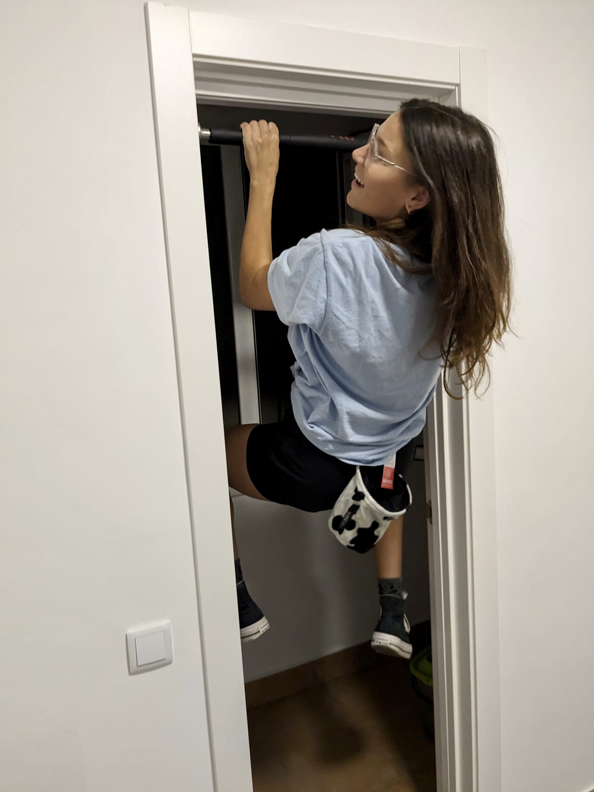

<html>
<head>
    <title>Inspiration Gallery</title>
    
</head>
<body>
    <h3>But first, a lil photo dump :)</h3>
    

        

            
        

        

            
        

        

            
        

        

            
        

        

            
        

        

            
        

        

            
        

        

            
        

        

            
        

        

            
        

        

            
        

        

            
        

        <!-- Add more images as needed -->
    

</body>
</html>